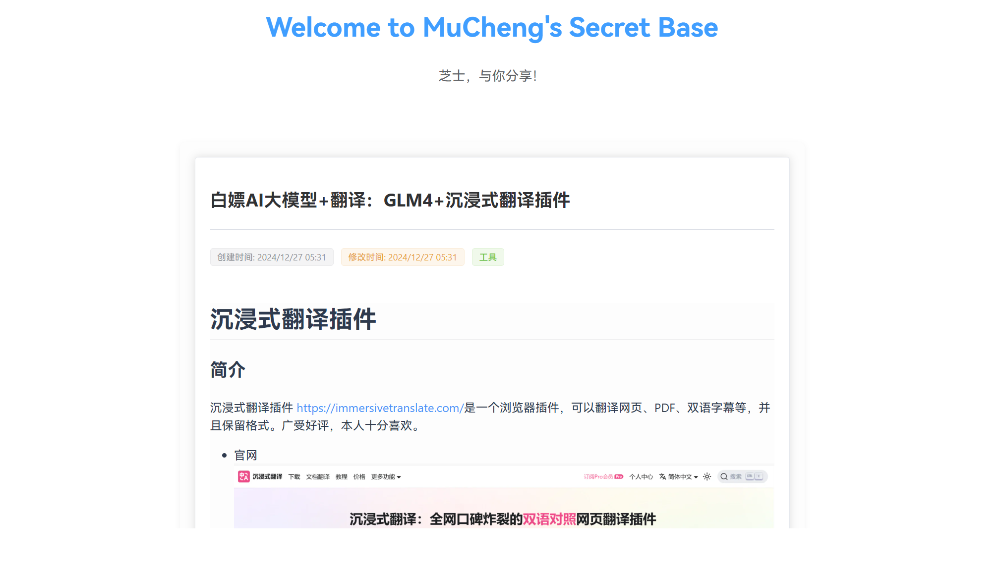
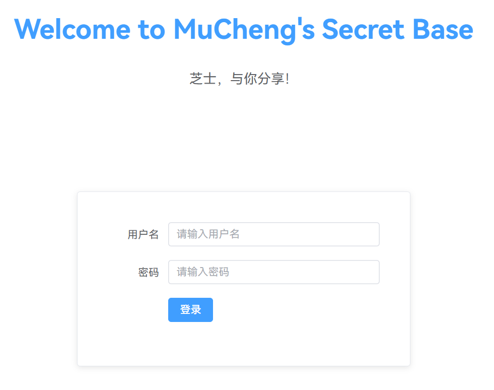
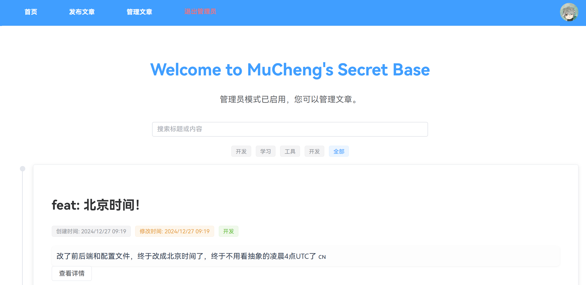
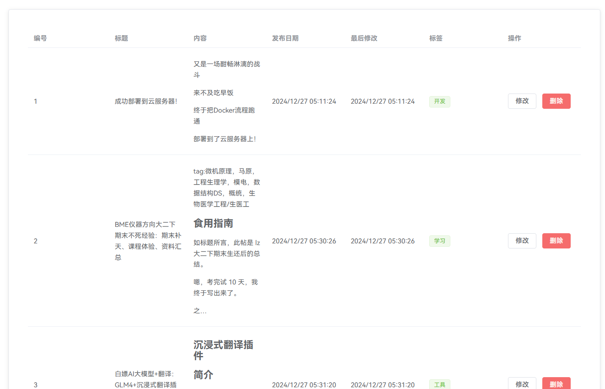
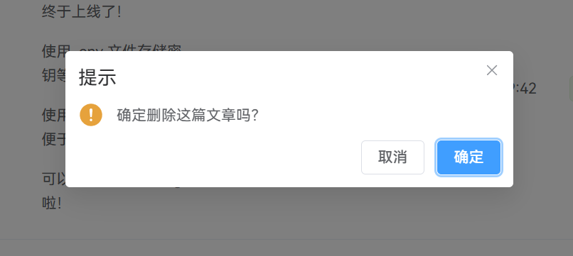
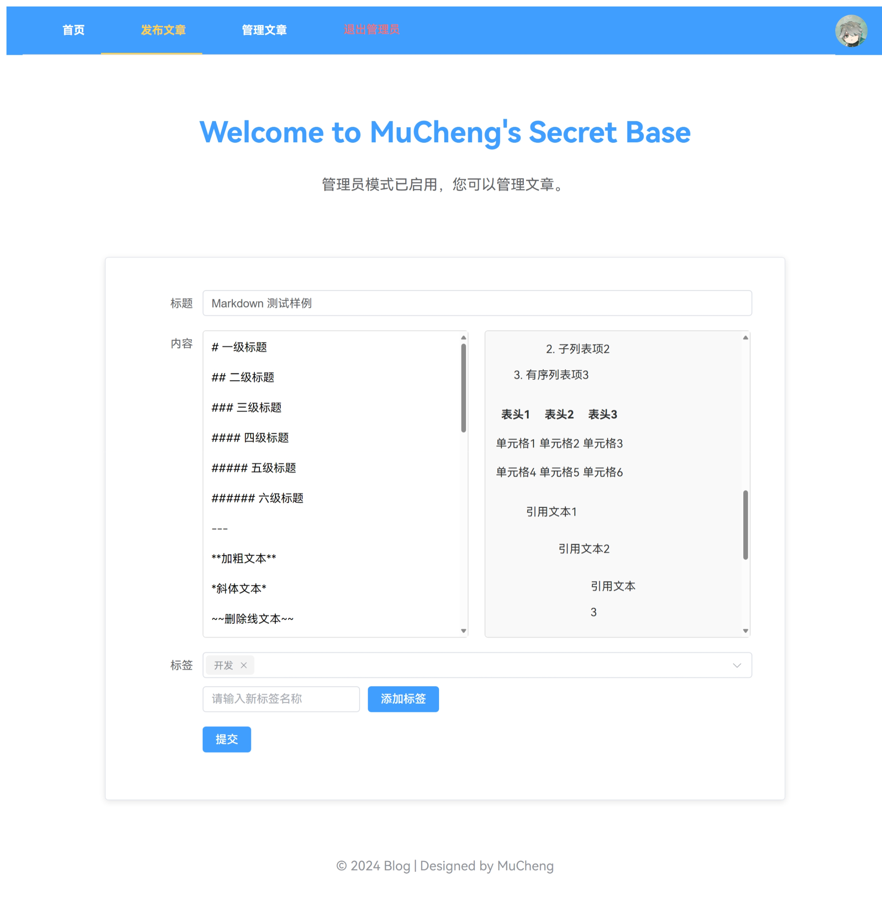

# MDVSBlog

> 一个基于 **M**ySQL + **D**ocker + **V**ue + **S**pring **B**oot 的前后端分离博客系统

## 目录

- [项目简介](#项目简介)
- [功能特点](#功能特点)
- [技术栈](#技术栈)
- [项目结构](#项目结构)
- [安装与运行](#安装与运行)
    - [前端](#前端)
    - [后端](#后端)
    - [Docker 部署](#docker-部署)
- [功能展示](#功能展示)
- [代码解析](#代码解析)
- [贡献指南](#贡献指南)
- [许可证](#许可证)

---

## 项目简介

本项目是一个博客管理系统，支持管理员登录、文章管理，以及基于 Markdown 的内容编辑器。它通过前后端分离架构实现高效开发与易用性。

---

## 功能特点

- 访客阅读和查找文章
- 基于 JWT 的管理员登录认证与权限管理的增删改
- Markdown 编辑器支持
- 标签和分类管理
- Docker 支持，便于部署

---

## 技术栈

### 前端
- Vue 3
- Element Plus

### 后端
- Spring Boot
- MySQL

### 部署与构建
- Docker & Docker Compose
- Maven

---

## 项目结构

```plaintext
.
├── blog-frontend/          # 前端代码
│   ├── public/             # 静态资源
│   ├── src/                # 前端源代码
│   │   ├── components/     # 公共组件
│   │   ├── views/          # 页面组件
│   │   ├── router/         # 路由配置
│   │   ├── services/       # API 接口
│   └── vue.config.js       # 配置文件
├── src/                    # 后端代码
│   ├── main/java/          # Java 源代码
│   ├── main/resources/     # 配置和资源文件
│   └── test/               # 测试代码
├── docker-compose.yml      # Docker 编排文件
├── pom.xml                 # Maven 配置
├── demo.env                # 示例环境变量(需重命名为 .env)
└── README.md               # 项目说明
```

---

## 安装与运行

### Docker 快速部署

1. 克隆前后端镜像：

   ```bash
   docker pull muchengzju/blog-frontend:latest
   docker pull muchengzju/blog-backend:latest
   ```
   
2. 克隆本仓库内的 `docker-compose.yml` 和 `demo.env` 文件：

   ```bash
   curl -O https://raw.githubusercontent.com/MuChengZJU/Blog/master/docker-compose.yml
   curl -O https://raw.githubusercontent.com/MuChengZJU/Blog/master/demo.env
   ```

3. 复制 `demo.env` 文件为 `.env` 文件，并根据需要修改其中的环境变量，在文件中有对应说明。

4. 运行 Docker 容器：

   ```bash
   docker-compose up
   ```

   项目会根据 `docker-compose.yml` 文件中的配置启动前端、后端和数据库容器。

   - 前端：`http://localhost:9091`
   - 后端 API：`http://localhost:9090/api`

### 项目完整克隆

找一个合适的地方，悄悄地把项目克隆到本地：
```bash
git clone https://github.com/MuChengZJU/Blog.git
```
或者用你喜欢的方式把代码扒下来 :)

### 本地开发运行

注意：

由于能力有限，项目目前跑 Docker 流程最顺，因为环境变量配置在 `.env` 文件中，而这造成 Maven 无法直接读取，所以我禁用了检查，当前代码跑得起来。如果你在在本地运行，可能需要手动修改 `application.properties` 文件中的数据库连接信息。

#### 前端

1. 在 `Blog/blog-fronted` 前端目录安装依赖：
   ```bash
   cd blog-frontend
   npm install
   ```
2. 运行开发服务器：

   ```bash
   npm run serve
   ```

#### 后端

1. 配置数据库（MySQL）：
    - 在 `src/main/resources/application.properties` 中修改数据库连接信息。
    - 初始化数据库
      - 设置root密码
      - 创建数据库：`CREATE DATABASE db_blog;`
      - ( 可选 ) 创建专用的数据库用户

2. 启动后端服务：

   如果你在 `IDEA` 中运行后端，可以直接运行 `BlogApplication` 类。

   或者在 `Blog` 根目录运行：
   ```bash
   mvn spring-boot:run
   ```

### 打包项目和部署

1. 在 `Blog/blog-frontend` 前端目录打包：
   ```bash
   npm run build
   ```
   会在 `dist` 目录下生成前端静态文件。

2. 在 `Blog` 根目录打包后端：
   ```bash
   mvn clean package
   ```
   会在 `target` 目录下生成后端 jar 包。

3. 在你的服务器上部署后端 jar 包和前端静态文件，方法自选，例如
    - 使用 `nohup` 后台运行 jar 包
    - 使用 `nginx` 部署前端静态文件

### Docker 部署

1. 配置环境变量：
    - 复制 `demo.env` 文件为 `.env` 文件，并根据需要修改其中的环境变量，在文件中有对应说明。
    - 这些环境变量会在 Docker 容器中使用。
    有如下的环境变量：
   ```plaintext
   SPRING_DATASOURCE_URL=jdbc:mysql://db:3306/blog_db # 数据库连接
   SPRING_DATASOURCE_USERNAME=EDITABLE_USERNAME
   SPRING_DATASOURCE_PASSWORD=EDITABLE_PASSWORD
   SERVER_PORT=9090                                   # 后端端口
   JWT_SECRET=EDITABLE_SECRET                         # 需要符合base64编码规则
   ADMIN_USERNAME=EDITABLE_USERNAME
   ADMIN_PASSWORD=EDITABLE_PASSWORD
   # MySQL 环境变量
   MYSQL_ROOT_PASSWORD=EDITABLE_PASSWORD              # 初始化数据库密码
   MYSQL_DATABASE=EDITABLE_DATABASE                   # 初始化数据库名称
   ```
   
2. 在 `Blog` 根目录构建并运行容器：

   ```bash
   docker-compose up --build
   ```
    项目会根据 `docker-compose.yml` 文件中的配置启动前端、后端和数据库容器。
    - 前端：`Blog\blog-frontend\Dockerfile`
    - 后端：`Blog\Dockerfile`
    - 数据库：`mysql:8`，在服务器上会自己创建容器。
      - 注意可能遇到 Docker 拉取镜像慢的问题，可以使用一些*魔法*，以及先手动拉取镜像。

### 访问项目：

    - 前端：`http://localhost:9091`
    - 后端 API：`http://localhost:9090/api`

---


## 功能展示

1. **首页**
    
    - 首页有按照时间线排列的所有文章。
    - 顶栏有搜索框，可以根据关键字搜索文章。
    - 右上角有可自定义的头像和个人链接。
    - 点击标签可以查看对应标签的文章。

    

2. **文章内容**

    点击`查看详情`可以进入查看完整的文章内容。（它甚至可以加载图片，此图是从 98 的图床加载过来的，但是不经过博客服务器，也就是用户前端从 98 读取的，所以需要在可连接图床的环境下才能看到，也就是连接校网才能看到 98 图床里的图片）

    

3. **管理员登录**

   点击右上角的`管理员登录`按钮，输入管理员账号密码即可登录。管理员账号密码通过配置文件中设置，通过 Docker 部署则通过 `.env -> docker-compose.yml -> application.properties -> 后端程序` 在后端初始化且无法改变（是的这很不优雅 QAQ）。

    

    登录后，请**刷新网页**，这样可以看到文章管理页面和发布文章的选项，可以对文章进行增删改查。

    

4. **文章管理**

    - 点击`文章管理`可以查看所有文章，可以对文章进行增删改查。
    - 点击修改会跳转到文章编辑页面，可以修改文章内容。
    - 点击删除会删除文章，且有弹窗提示。

    

    

5. **文章编辑和发布**

    - 点击`发布文章`可以进入文章编辑页面，支持 Markdown 编辑。
   
    

---

## 代码解析

### 前端

#### 主要代码结构功能

1. **页面导航**：
   - 通过 `index.js` 定义的路由，支持页面间的跳转，如首页、文章详情、管理员登录、文章发布与管理。
2. **动态设置网页标题**：
   - 在 `main.js` 中，通过 `router.beforeEach` 动态设置页面标题。
3. **用户认证**：
   - 在 `api.js` 中，拦截器会检测本地存储的 `token`，并在未授权时重定向至登录页面。
4. **文章管理**：
   - 提供文章的查看、发布和管理功能，由多个页面组件配合实现。

#### 核心逻辑代码

1. **动态标题设置**（`main.js`）：
   ```javascript
   router.beforeEach((to, from, next) => {
       document.title = "MuCheng's Secret Base " + to.meta.title || "MuCheng's Secret Base"; // 默认标题
       next();
   });
   ```

2. **路由配置**（`index.js`）：
   ```javascript
   const routes = [
       { path: '/', component: ArticleList, meta: { title: '首页' } },
       { path: '/article/:id', component: ArticleView, meta: { title: '文章' } },
       { path: '/login', component: AdminLogin, meta: { title: '管理员登录' } },
       { path: '/publish', component: ArticleForm, meta: { title: '发布文章' } },
       { path: '/manage', component: ArticleManagement, meta: { title: '管理文章' } },
   ];
   ```

3. **API 请求拦截器**（`api.js`）：
   ```javascript
   apiClient.interceptors.request.use((config) => {
       const token = localStorage.getItem('token');
       if (token) {
           config.headers['Authorization'] = `Bearer ${token}`;
       }
       return config;
   });

   apiClient.interceptors.response.use(
       (response) => response,
       (error) => {
           if (error.response && error.response.status === 401) {
               localStorage.removeItem('token');
               window.location.href = '/login'; // 重定向到登录页面
           }
           return Promise.reject(error);
       }
   );
   ```

#### 代码和接口规范

1. **命名规范**：
   - 文件名使用 PascalCase（如 `ArticleForm.vue`）。
   - 变量和函数名采用 camelCase（如 `apiClient`）。
2. **接口约定**：
   - 基础 URL 通过动态协议和主机名拼接：`${protocol}//${hostname}:${port}/api`。
   - 请求头默认为 `Content-Type: application/json`。
3. **组件开发**：
   - 每个页面组件负责单一功能，模块化设计，便于维护。
   - 通过 `props` 和 `emits` 实现组件间的数据流动。
4. **错误处理**：
   - 未授权时清除本地存储的 `token`，并重定向到登录页面。

### 后端

#### 代码结构
项目的后端代码主要基于 Spring Boot 和 Spring Data JPA 框架开发，目录结构如下：
1. **配置类**：
   - `CorsConfig`：配置跨域访问规则。
   - `SecurityConfig`：配置安全规则、JWT 认证和角色权限管理。
   - 数据库配置文件：`application.properties`，包括数据库连接和 JWT 密钥。

2. **入口类**：
   - `BlogApplication`：Spring Boot 应用的主入口。

3. **控制器**：
   - `ArticleController`：文章管理接口，包括增删改查功能。
   - `AuthController`：用户登录认证接口。
   - `TagController`：标签管理接口。

4. **实体类**：
   - `Article`：文章实体，包含分类和标签关联。
   - `Category`：分类实体。
   - `Tag`：标签实体。
   - `User`：用户实体，用于认证与授权。

5. **数据访问层**：
   - `ArticleRepository`：文章数据操作接口。
   - `TagRepository`：标签数据操作接口。
   - `UserRepository`：用户数据操作接口，支持通过用户名查询用户信息。

---

#### 主要功能
1. **文章管理**：
   - 查询所有文章。
   - 根据 ID 查询文章详情。
   - 创建新文章、更新或删除现有文章。

2. **用户认证**：
   - 用户登录，返回 JWT Token。

3. **标签管理**：
   - 查询所有标签。
   - 创建新标签。

4. **安全与跨域**：
   - 使用 Spring Security 实现基于 JWT 的认证和权限管理。
   - 支持角色权限分离，例如管理员可执行增删改操作，普通用户仅可查询。
   - 配置跨域访问规则，允许特定来源访问。

---

#### 核心逻辑代码解读

1. **RESTful API 的使用**
   - **功能**：设计清晰的接口，支持文章、标签和用户的增删改查。
   - **核心代码（以文章操作为例）**：
     ```java
     @GetMapping("/{id}")
     public Article getArticleById(@PathVariable Long id) {
         return articleService.findById(id);
     }

     @PostMapping
     public Article createArticle(@RequestBody Article article) {
         return articleService.save(article);
     }

     @DeleteMapping("/{id}")
     public void deleteArticle(@PathVariable Long id) {
         articleService.deleteById(id);
     }
     ```
      - `GET /api/articles/{id}` 获取文章详情。
      - `POST /api/articles` 创建文章，接收 JSON 数据。
      - `DELETE /api/articles/{id}` 删除指定文章。
      - 数据操作通过 `ArticleService` 调用 `ArticleRepository` 实现。
     
2. **JWT 认证与授权**
   - **功能**：使用 JWT（JSON Web Token）实现用户认证与授权。
   - **核心代码**：
     ```java
     @Bean
     public SecurityFilterChain securityFilterChain(HttpSecurity http) throws Exception {
         http.csrf().disable()
             .sessionManagement().sessionCreationPolicy(SessionCreationPolicy.STATELESS)
             .and()
             .authorizeHttpRequests(authorize -> authorize
                     .requestMatchers("/api/auth/login").permitAll()
                     .requestMatchers("/api/articles").permitAll()
                     .requestMatchers("/api/articles/**").hasRole("ADMIN")
                     .anyRequest().authenticated()
             )
             .addFilterBefore(jwtTokenFilter, UsernamePasswordAuthenticationFilter.class);
         return http.build();
     }
     ```
      - 禁用 CSRF，采用无状态会话（Stateless），通过 JWT 实现用户认证。
      - 配置权限：
         - `GET /api/articles` 对所有用户开放。
         - `POST /api/articles` 仅限管理员角色访问。
      - `JwtTokenFilter` 验证请求中的 JWT，确保访问安全。

3. **跨域配置**
   - **功能**：支持前端跨域访问，确保前后端分离环境下的正常通信。
   - **核心代码**：
     ```java
     @Override
     public void addCorsMappings(CorsRegistry registry) {
         registry.addMapping("/**")
                 .allowedOriginPatterns("http://*:9091")
                 .allowedMethods("GET", "POST", "PUT", "DELETE", "OPTIONS")
                 .allowCredentials(true);
     }
     ```
      - 匹配所有 API 路径（`/**`）。
      - 允许来自 `http://*:9091` 的请求，支持动态来源。
      - 支持跨域的 Cookie 传递（如 JWT 认证场景）。

4. **用户认证与存储**：
   - 用户通过 `AuthController` 提交用户名和密码登录。
   - 在服务层中调用 `UserRepository`，根据用户名查询用户数据，并校验密码。
   - 登录成功后生成并返回 JWT Token。

5. **数据操作**：
   - 使用 Spring Data JPA 的 Repository 接口实现数据操作，简化了 CRUD 的实现。
   - 例如，`ArticleRepository` 和 `TagRepository` 提供文章与标签的数据库访问。

6. **动态权限控制**：
   - `SecurityConfig` 配置基于路径的权限控制，例如 `/api/articles/**` 仅管理员可访问增删改功能，而 `/api/articles` 对所有用户开放。

---

#### 代码和接口规范

1. **RESTful API**：
   - 路由设计符合 RESTful 风格。
   - 动词与 HTTP 方法匹配：GET（查询）、POST（创建）、PUT（更新）、DELETE（删除）。

2. **实体与数据库表的映射**：
   - 使用 `@Entity` 和 `@Table` 注解，明确实体与数据库表的对应关系。
   - 字段设计规范，例如 `User` 的用户名字段必须唯一。

3. **接口返回格式**：
   - 认证接口返回 JSON 格式：`{"token": "xxx"}`。
   - 数据查询接口返回实体列表或单个对象。

4. **代码风格**：
   - 遵循 Java 命名规范，方法命名具有描述性。
   - 提供适当的注释，便于代码阅读与维护。


---

## 贡献指南

欢迎贡献代码或提出建议！

1. Fork 仓库
2. 创建新分支：
   ```bash
   git checkout -b feature/your-feature
   ```
3. 提交代码并创建 PR。

---

## 许可证

本项目采用 [MIT License](LICENSE)。

